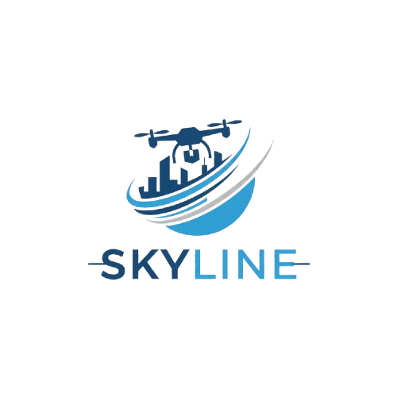

# SkyLink Dispatch Platform

<div align="center">
  
  
  <p><strong>Multi-sector drone dispatch platform for emergency services, delivery networks, and remote operations</strong></p>
  
  [](https://www.typescriptlang.org/)
  [](https://reactjs.org/)
  [](https://nodejs.org/)
  [](https://expressjs.com/)
  [](https://tailwindcss.com/)
  [](LICENSE)
</div>

---

## Overview

SkyLink is a comprehensive drone dispatch platform designed to facilitate critical operations in challenging environments. Based in **Senegal**, the platform serves multiple sectors including emergency services, delivery companies, restaurants, and law enforcement agencies. SkyLink creates new economic opportunities by enabling operators worldwide to become certified drone pilots without requiring advanced education, providing a sustainable income source through semi-autonomous mission execution.

### Key Features

- **Dual-Mode Interface**: Separate client and operator dashboards for mission creation and execution
- **Real-Time Telemetry**: Live drone tracking with battery, location, speed, and signal quality monitoring
- **Semi-Autonomous Control**: Operator-assisted flight with virtual joystick controls and emergency overrides
- **Multi-Sector Support**: Designed for police facial recognition, firefighter operations, medical deliveries, and commercial logistics
- **Mission Management**: Complete lifecycle tracking from request to completion with operator earnings tracking

## Architecture

SkyLink follows a three-tier architecture:

### Step 1: Field Client (Drone Hardware)
- **CubePilot Orange**: Flight controller
- **Jetson Orion**: Onboard computer
- **4G/5G Connectivity**: Internet connection via mobile network
- **MAVProxy Bridge**: Lightweight script connecting CubePilot to central server

### Step 2: Central Server (Core Brain)
- **Location**: Runs 24/7 on cloud infrastructure (Railway recommended)
- **REST API**: Mission management endpoints
- **Event Streaming**: Server-Sent Events (SSE) for real-time updates
- **Mission Store**: In-memory mission tracking with status management
- **Note**: Telemetry and drone control handled by separate server

### Step 3: Client Application (Web/Mobile)
- **Client Dashboard**: Request deliveries, track missions, view history
- **Operator Dashboard**: Accept missions, view available jobs, monitor earnings
- **Pilot Control Room**: Real-time telemetry, virtual joysticks, emergency controls
- **WebSocket/SSE Integration**: Live updates without polling

## Technology Stack

### Frontend
- **Vite**: Build tool and development server
- **React 18**: UI framework with TypeScript
- **shadcn/ui**: Component library
- **Tailwind CSS**: Utility-first styling
- **React Router**: Client-side routing
- **Supabase**: Authentication and user management
- **Sonner**: Toast notifications

### Backend
- **Node.js**: Runtime environment
- **Express**: Web framework
- **TypeScript**: Type-safe development
- **tsx**: ES module execution for development
- **CORS**: Cross-origin resource sharing
- **dotenv**: Environment configuration

### Deployment
- **Frontend**: Vercel (automatic deployments from GitHub)
- **Backend**: Railway (recommended) or Render
- **Database**: Supabase (PostgreSQL with RLS)

## Getting Started

### Prerequisites

- Node.js 18+ and npm
- Git
- Supabase account (for authentication)

### Installation

1. **Clone the repository**
   ```bash
   git clone <repository-url>
   cd skylink-dispatch
   ```

2. **Install frontend dependencies**
   ```bash
   npm install
   ```

3. **Install backend dependencies**
   ```bash
   cd server
   npm install
   cd ..
   ```

4. **Configure environment variables**
   
   Create a `.env` file in the root directory:
   ```env
   VITE_SUPABASE_URL=your_supabase_url
   VITE_SUPABASE_ANON_KEY=your_supabase_anon_key
   VITE_CORE_API_URL=http://localhost:4000
   ```
   
   Create a `.env` file in the `server` directory:
   ```env
   PORT=4000
   ```

### Running the Application

#### Development Mode

1. **Start the core server** (Terminal 1)
   ```bash
   cd server
   npm run dev
   ```
   Server will start on `http://localhost:4000`

2. **Start the frontend** (Terminal 2)
   ```bash
   npm run dev
   ```
   Application will start on `http://localhost:5173`

#### Production Build

1. **Build the frontend**
   ```bash
   npm run build
   ```

2. **Build the backend**
   ```bash
   cd server
   npm run build
   npm start
   ```

## Project Structure

```
skylink-dispatch/
├── public/
│   ├── logo-final.png          # Main logo asset
│   └── robots.txt
├── server/                      # Core server (Step 2)
│   ├── src/
│   │   ├── index.ts            # Express server entry point
│   │   ├── missionStore.ts    # Mission state management
│   │   └── types.ts            # TypeScript definitions
│   ├── package.json
│   └── tsconfig.json
├── src/
│   ├── components/             # React components
│   │   ├── ui/                # shadcn/ui components
│   │   ├── BottomNav.tsx
│   │   └── ProtectedRoute.tsx
│   ├── contexts/
│   │   └── AuthContext.tsx    # Authentication state
│   ├── hooks/
│   │   ├── useTelemetry.tsx   # Telemetry streaming hook
│   │   └── useGamepad.ts      # Gamepad/joystick support
│   ├── integrations/
│   │   └── supabase/          # Supabase client
│   ├── lib/
│   │   ├── api.ts             # Core API client
│   │   └── config.ts          # Configuration
│   ├── pages/
│   │   ├── Index.tsx          # Landing page
│   │   ├── Auth.tsx           # Login/signup
│   │   ├── Dashboard.tsx      # Dual-mode dashboard
│   │   ├── CreateDelivery.tsx # Client delivery request
│   │   ├── OperatorDashboard.tsx
│   │   ├── PilotControl.tsx   # Operator control room
│   │   └── ...
│   ├── App.tsx
│   └── main.tsx
├── index.html
├── package.json
└── README.md
```

## API Endpoints

### Core Server (Port 4000)

- `GET /health` - Health check
- `GET /api/missions` - List all missions
- `GET /api/missions/active` - List active missions
- `POST /api/missions` - Create new mission
- `POST /api/missions/:id/assign` - Assign mission to operator
- `POST /api/missions/:id/status` - Update mission status
- `GET /api/telemetry/latest` - Get latest telemetry frames
- `GET /api/telemetry/stream` - SSE stream of telemetry updates
- `POST /api/telemetry/mock` - Inject mock telemetry (testing)
- `POST /api/commands` - Send command to drone

## Testing Telemetry

To test the real-time telemetry system:

1. Start both servers (frontend and backend)
2. Send a mock telemetry packet:
   ```bash
   curl -X POST http://localhost:4000/api/telemetry/mock \
     -H "Content-Type: application/json" \
     -d '{
       "droneId": "demo-drone-1",
       "battery": 84,
       "latitude": 14.7167,
       "longitude": -17.4677,
       "altitude": 150,
       "speed": 18,
       "heading": 72,
       "signalQuality": 92,
       "status": "in-flight"
     }'
   ```
3. Open the dashboard or pilot control room to see live updates

## Deployment

### Backend Deployment (Railway - Recommended)

See [RAILWAY_SETUP.md](./RAILWAY_SETUP.md) for detailed instructions.

**Quick Steps:**
1. Sign up at [railway.app](https://railway.app)
2. Create new project → Deploy from GitHub
3. Set root directory to `server`
4. Railway auto-detects build/start commands
5. Get your Railway URL (e.g., `https://skylink-production.up.railway.app`)
6. Set `VITE_CORE_API_URL` in Vercel to your Railway URL

### Frontend Deployment

The frontend can be deployed to:
- Vercel
- Netlify
- AWS Amplify
- Any static hosting service

Set the `VITE_CORE_API_URL` environment variable to point to your deployed core server.

### Backend Deployment

The core server can be deployed to:
- Fly.io
- Render
- Railway
- AWS EC2
- DigitalOcean
- Any Node.js-compatible hosting

Ensure the server has:
- Persistent connection (24/7 uptime)
- Public IP address or domain
- Environment variables configured
- Note: This server handles mission management only. Telemetry and drone control are handled separately.

## Contributing

This is a proprietary platform. For contribution guidelines, please contact the development team.

## License

Proprietary - All rights reserved

## Support

For technical support or inquiries:
- Base of Operations: Senegal
- Platform: Multi-sector drone dispatch
- Focus: Emergency services, delivery, and remote operations

---

<div align="center">
  <p>Built with precision for critical operations worldwide</p>
  <p><strong>SkyLink Dispatch Platform</strong></p>
</div>
